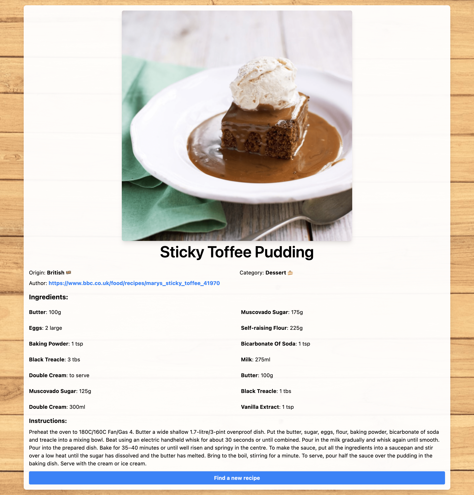
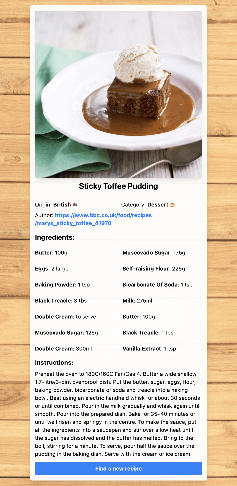

# Recipe card

A simple recipe card made with tailwindcss

## Table of Contents

- [Recipe card](#recipe-card)
  - [Table of Contents](#table-of-contents)
  - [Installation](#installation)
  - [Usage](#usage)
  - [Screenshots](#screenshots)
  - [License](#license)
  - [Acknowledgements](#acknowledgements)

## Installation

```sh
git clone https://github.com/brianlangley/tailwind-showcase.git
```

## Usage

After cloning this repository, open the `Beginner/Recipe-card/index.html` file in your browser.

## Screenshots




## License

Distributed under the Apache v2.0 License. See `LICENSE` in the main folder of this repository for more information.

## Acknowledgements

- [Tailwindcss](https://tailwindcss.com/)
- [Pexels](https://www.pexels.com/)
- [Vue](https://vuejs.org/)
